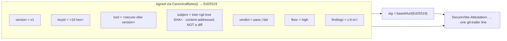
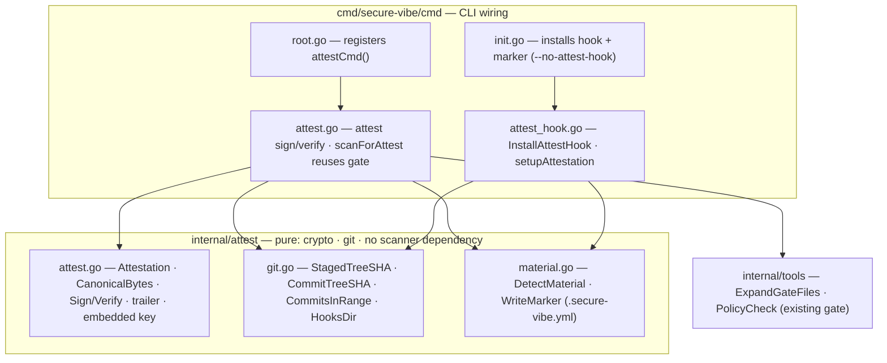
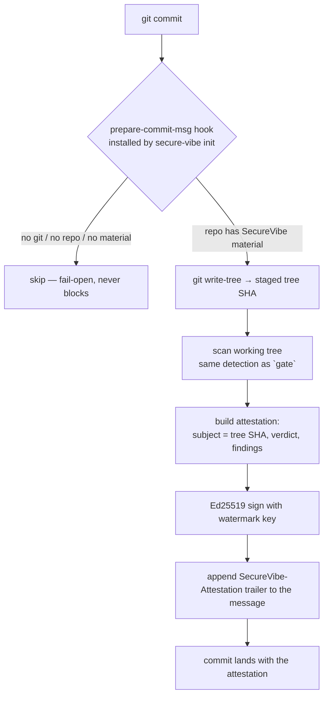
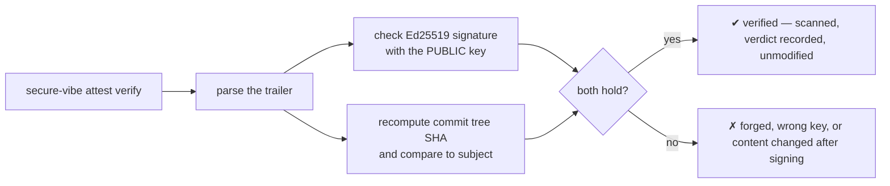
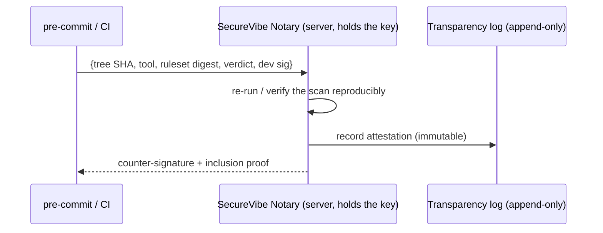

# Usage attestation

SecureVibe can stamp each commit with a tamper-evident **usage attestation** — a
signal that the commit's code was scanned by `secure-vibe`, together with the
verdict. Detecting whether a developer used SecureVibe is then a one-liner:

```bash
git log --grep '^SecureVibe-Attestation:'
secure-vibe attest verify --range origin/main..HEAD
```

!!! warning "It is a watermark, not a security guarantee"
    The signing key is an Ed25519 **watermark key shipped inside the binary** — by
    design, extractable. That is fine for the goal: **detecting that an honest
    developer used SecureVibe.** It does *not* prove that a malicious developer
    could not have forged it. A present, valid attestation is strong evidence of
    use; its **absence proves nothing** (the developer may have used
    `git commit --no-verify`).

## What gets signed

The attestation binds a **content-addressed subject** — the git **tree SHA** of
the staged commit — to the scan verdict. It never signs a raw `git diff`: diffs
are non-canonical (they depend on `diff.algorithm`, rename detection, context
lines, CRLF), which would cause false negatives on verify. The tree SHA is
stable and is exactly what the commit points at.

The trailer (one line, appended to the commit message):

```
SecureVibe-Attestation: v1 keyid=<8 bytes> tool=<version> subject=tree:<sha> \
                        verdict=<pass|fail> floor=<severity> findings=<c:h:m:l> sig=<base64url>
```

The signature covers `{version, keyid, tool, subject, verdict, floor, findings}`.
Verification needs **only the public key**, so the private signer can later move
server-side (a notary) with no change to the on-disk format or the verify path.

### Trailer anatomy



## Code map



## How a commit gets attested



Findings **never block the commit** — the verdict (`pass`/`fail`) is recorded
either way (use `attest sign --block` if you want enforcement instead of a
watermark).

## How verification works



Because the subject is the tree SHA, editing the code after signing (without
re-attesting) makes the subject no longer match the commit's tree → verify flags
it. This is the tamper-evidence.

## Two commit paths

Both an AI agent and a manual commit converge on the same marker:

| Path | How it attests |
|------|----------------|
| **AI agent** (Claude Code, Cursor, …) | The generated assistant config includes the guideline below; the agent runs `secure-vibe attest sign` before committing. |
| **Manual** `git commit` | The `prepare-commit-msg` hook (installed by `secure-vibe init`) attests automatically. |

The hook is the reliable path; the agent guideline is a fallback for agents that
bypass hooks. Either way, `--no-verify` skips it — acceptable for a usage signal.

### Guideline for AI agents

Add to your assistant's rules (`CLAUDE.md` / `.cursorrules` / `AGENTS.md`):

> Before creating a git commit, run `secure-vibe attest sign --message-file
> <the commit message file>` (or rely on the installed `prepare-commit-msg`
> hook). This records that SecureVibe scanned the change. Never remove or
> hand-edit a `SecureVibe-Attestation:` trailer.

## Commands

```bash
secure-vibe attest install-hooks        # add the prepare-commit-msg hook to this repo
secure-vibe attest sign                  # print a signed trailer for the staged tree
secure-vibe attest verify [commit]       # verify one commit (default HEAD)
secure-vibe attest verify --range A..B   # verify a range; non-zero exit if any present one is bad
```

`secure-vibe init` installs the hook and drops a `.secure-vibe.yml` marker
automatically (opt out with `--no-attest-hook`).

## Upgrade path: from watermark to notary

If you ever need attestations that a third party can trust **without re-running**
the scan, move the private key server-side:



Only the signer changes; the trailer format and `attest verify` stay the same —
which is why the format is asymmetric from day one.
